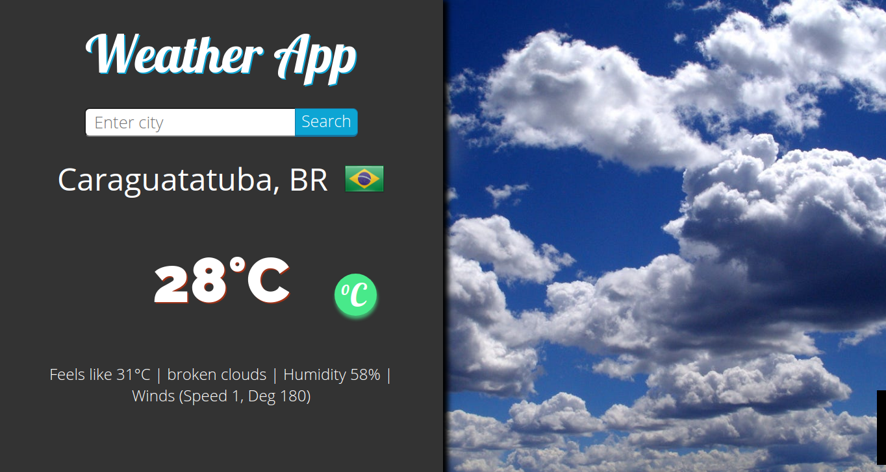

# Weather App

[](https://app.netlify.com/sites/clever-beaver-4d5c90/deploys)
[]()
[]()
[]()

<a text-align="center" href="#about">About</a>&nbsp;&nbsp;&nbsp;|&nbsp;&nbsp;&nbsp;
<a href="#with">Built with</a>&nbsp;&nbsp;&nbsp;|&nbsp;&nbsp;&nbsp;
<a href="#ldl">Live Demo</a>&nbsp;&nbsp;&nbsp;|&nbsp;&nbsp;&nbsp;
<a href="#author">Author</a>



## About <a name = "about"></a>

> App to search weather information by city, with temperatures in celsius or fahrenheit.

## 🔧 Built with<a name = "with"></a>

- HTML5 & SASS
- Javascript
- Webpack
- Open Weather API
- Country Flags API

## 🔴 Live Demo <a name = "ldl"></a>

[Live Demo Link](https://clever-beaver-4d5c90.netlify.app/)


## Getting Started

To get a local copy up and running follow these simple example steps.

```
$ cd <folder>
$ git clone https://github.com/ldelbel/weather-app
$ cd weather-app

```

### Setup

Setup the environment for webpack.

```
$ npm install
$ npm run build
$ npm start  // for live view

```

### Prerequisites

- npm

## ✒️  Author <a name = "author"></a>

👤 **Lucas Delbel**

- Github: [@ldelbel](https://github.com/ldelbel)
- Twitter: [@delbel_lucas](https://twitter.com/delbel_lucas)
- Linkedin: [lucasdelbel](https://www.linkedin.com/in/lucasdelbel/)


## 🤝 Contributing

Contributions, issues and feature requests are welcome!

Feel free to check the [issues page](issues/).

## Show your support

Give a ⭐️ if you like this project!

## :clap: Acknowledgements

- Microverse: [@microverse](https://www.microverse.org/)
- [The Odin Project](https://www.theodinproject.com/courses/javascript/lessons/weather-app)

## 📝 License

This project is [MIT](lic.url) licensed.
